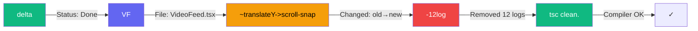
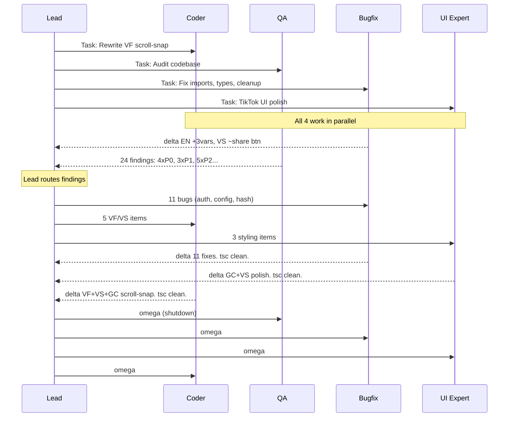
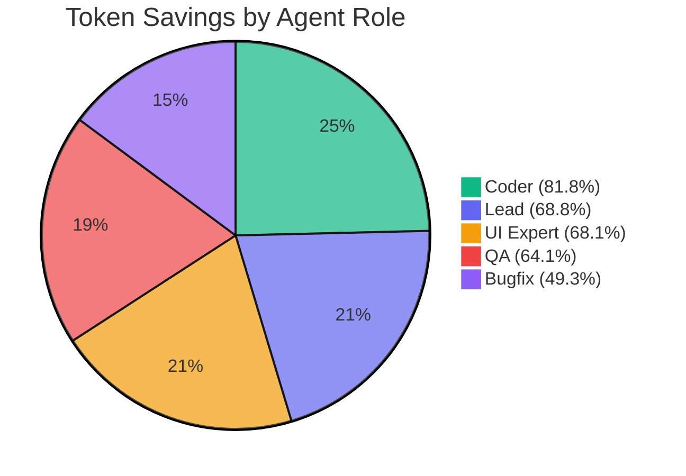
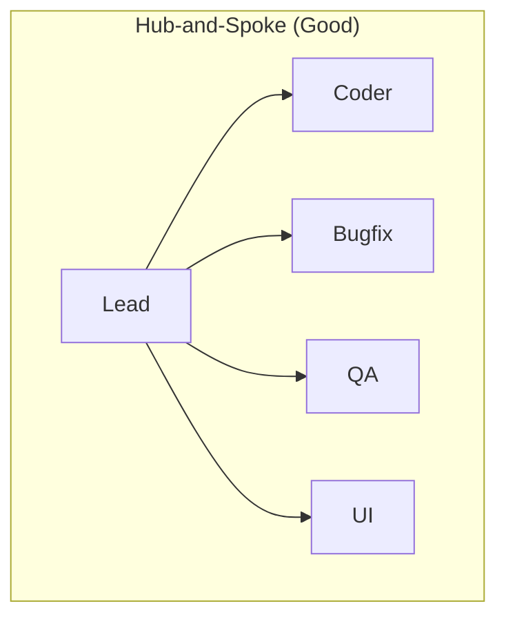

## The Moment I Realized Agents Are Terrible at Talking to Each Other

I was running a team of 4 AI agents on a real project — a TikTok-style kids video platform built with Next.js and Fastify. One agent rewrites the scroll system, one audits for bugs, one fixes them, one polishes the UI.

They were crushing it. 24 bugs found, 16 fixed, a full component rewrite — all in ~8 minutes.

But when I looked at the inter-agent messages, I saw this:

> "Hi team! I've finished working on the VideoFeed component. I removed all the console.log statements (there were 12 of them) and changed the animation from translateY to CSS scroll-snap. Everything compiles cleanly now. Let me know if you need anything else!"

**~40 tokens.** For a status update. Multiply that by hundreds of messages across 4 agents, and you're burning tokens on *"Hi team!"* and *"Let me know if you need anything!"* — words that add zero value to an AI-to-AI conversation.

So I asked: **what if agents spoke their own language?**

---

## Meet AgentSpeak: A Protocol Agents Actually Want to Use

The same message in AgentSpeak:

```
delta VF ~translateY->scroll-snap -12log. tsc clean.
```

**~15 tokens.** Same information. No filler.

Here's how it breaks down:



### The Building Blocks

**Status codes** use Greek letters — short, distinctive, no ambiguity:

| Code | Meaning | When |
|------|---------|------|
| `alpha` | Starting | Agent picks up a task |
| `beta` | Working | Progress update, no blockers |
| `gamma` | Blocked | Waiting on another agent |
| `delta` | Done | Task complete |
| `epsilon` | Bug | Reporting an issue |
| `omega` | Shutdown | Wrapping up |

**Actions** are single characters:

| Symbol | Meaning | Example |
|--------|---------|---------|
| `+` | Added | `+adminOnly middleware` |
| `-` | Removed | `-12 console.logs` |
| `~` | Changed | `~SHA256->bcrypt` |
| `!` | Broken | `!auth bypass L140` |
| `?` | Need | `? coder: VF status` |
| `->` | Becomes | `~translateY->scroll-snap` |

**File shortcodes** eliminate long paths:

```
VF = VideoFeed.tsx      VS = VideoSlide.tsx
AC = api-client.ts      GC = globals.css
CF = config/index.ts    RT = routes file
```

---

## Real-World: A 4-Agent Sprint

Here's how the protocol played out in a real session. Five agents (lead + 4 teammates) working on a Next.js + Fastify codebase simultaneously.



### What QA's Report Looked Like

Instead of paragraphs of prose, QA delivered this:

```
epsilon P0 content.routes !auth bypass L140-166 missing adminOnly
epsilon P0 engagement.routes !no ownership check L9-19
epsilon P0 content.routes !save/unsave no ownership L86-111
epsilon P1 CF !insecure SIGNING_SECRET default L26
epsilon P1 hash.ts !weak SHA-256 PIN hashing L13
epsilon P2 feed.monitoring !redis.keys O(N) L315
```

Six lines. Six critical findings. With file names, line numbers, and severity — everything a bugfix agent needs to act immediately, no follow-up questions.

### What Bugfix's Completion Report Looked Like

```
delta BUGFIX all QA bugs fixed:
- epsilon0 content.routes +adminOnly L140-166
- epsilon0 engagement.routes +ownership check L9-19
- epsilon1 CF -insecure .default() L26
- epsilon1 hash.ts ~SHA256->bcrypt
- epsilon2 feed.monitoring ~KEYS->SCAN
- epsilon2 content.service cursor fix L265
tsc clean. 11 files changed.
```

Every fix mapped back to the original finding by severity code and line number. The lead can verify at a glance without reading any code.

---

## The Benchmarks (Real Data, Not Theory)

I tokenized 10 real messages from the session using `tiktoken` (`cl100k_base`) and compared each AgentSpeak message against what the verbose English equivalent would have been.

```
┌────┬──────────────────────────┬───────────┬───────────┬──────────┬──────────┐
│ #  │ Message Type             │ AgentSpk  │ Verbose   │ Savings  │ Ratio    │
├────┼──────────────────────────┼───────────┼───────────┼──────────┼──────────┤
│  1 │ status_start             │      29   │      82   │   64.6%  │    2.8x  │
│  2 │ progress_report          │     325   │     557   │   41.7%  │    1.7x  │
│  3 │ qa_report                │     360   │     986   │   63.5%  │    2.7x  │
│  4 │ lead_routing             │     196   │     503   │   61.0%  │    2.6x  │
│  5 │ task_complete            │     232   │     516   │   55.0%  │    2.2x  │
│  6 │ task_complete_coder      │      59   │     325   │   81.8%  │    5.5x  │
│  7 │ task_complete_ui         │     242   │     784   │   69.1%  │    3.2x  │
│  8 │ lead_routing_coder       │      84   │     393   │   78.6%  │    4.7x  │
│  9 │ shutdown_ack             │      19   │      69   │   72.5%  │    3.6x  │
│ 10 │ cross_agent_coord        │      40   │     100   │   60.0%  │    2.5x  │
├────┼──────────────────────────┼───────────┼───────────┼──────────┼──────────┤
│ ΣΣ │ TOTAL                    │    1586   │    4315   │   63.2%  │    2.7x  │
└────┴──────────────────────────┴───────────┴───────────┴──────────┴──────────┘
```

### Per-Agent Breakdown



The **coder** saw 5.5x compression — code-related status updates (`delta VF ~translateY->scroll-snap`) are the most compressible because they're so formulaic. **Bugfix** had the lowest ratio at 49.3% because detailed multi-item completion reports inherently carry more information.

### Cost at Scale

| Scale | Tokens Saved | Cost Saved (@ $3/1M input) |
|-------|-------------|---------------------------|
| Per session | 2,729 | $0.008 |
| 100 sessions/day | 272,900 | **$0.82/day** |
| 3,000 sessions/mo | 8,187,000 | **$24.56/mo** |

But the real win isn't dollars — it's **context window**. Every token you don't waste on "Hi team!" is a token available for actual code reasoning. When your agents hit context limits and start compressing earlier, quality degrades. AgentSpeak pushes that cliff further out.

---

## The Patterns That Made It Work

### 1. Hub-and-Spoke, Not Mesh



All messages route through the lead. When QA found 24 bugs, the lead filtered them:
- 11 bugs to bugfix (backend, auth, config)
- 5 items to coder (relevant to the scroll rewrite)
- 3 items to UI expert (styling only)

Without routing, all 4 agents would process all 24 items = wasted tokens on irrelevant findings.

### 2. QA Is Read-Only

QA agents that can edit files will try to fix things. Then they clash with bugfix. Then you get merge conflicts. Then everyone wastes tokens coordinating.

Instead: **QA reads everything, edits nothing, produces one comprehensive report, shuts down immediately.** One message, zero conflicts.

### 3. File Ownership = Zero Merge Conflicts

```
Coder:     VideoFeed.tsx, VideoSlide.tsx, globals.css (scroll)
Bugfix:    Backend routes, config, api-client.ts
UI Expert: globals.css (visual only), VideoSlide.tsx (styling)
QA:        READ-ONLY (no files)
```

4 agents, ~25 files changed, **0 merge conflicts**. The constraint sounds restrictive but it eliminates an entire class of coordination overhead.

### 4. Shut Down Agents Immediately

An idle agent still processes incoming messages and burns tokens. The moment QA delivers their report — shut them down. Don't keep agents around "just in case."

Our shutdown order:
```
QA → Bugfix → UI Expert → Coder → Team cleanup
```

---

## The Lesson I Learned the Hard Way

After all 4 agents reported `delta ... tsc clean`, I trusted them. Everything compiles, right? Ship it.

**The scroll was completely broken.**

Turns out the break suggestion component was doing an early return that unmounted the entire scroll container. 3 fast scrolls inflated the video counter, triggered the break screen, and snapped back to video 1. `tsc --noEmit` can't catch UX bugs.

The fix was simple (overlay instead of early return, debounced counter), but the lesson was expensive:

> **The team lead MUST verify in the actual product.** Compiler green != working. Always test in the browser.**

I added this to the protocol as a rule.

---

## How to Use It

### 1. Add to your project

Drop [`TEAM_PROTOCOL.md`](https://github.com/yuvalsuede/claude-teams-language-protocol/blob/main/TEAM_PROTOCOL.md) into your `CLAUDE.md`:

```markdown
## Team Communication Protocol
All inter-agent messages MUST use AgentSpeak format.
See TEAM_PROTOCOL.md for the full specification.
```

### 2. Define your file shortcodes

```
VF = VideoFeed.tsx
VS = VideoSlide.tsx
AC = api-client.ts
# ... your project's key files
```

### 3. Include in spawn prompts

When creating team agents, include the protocol in each agent's spawn prompt. They'll adopt it immediately.

### 4. Run the benchmark on your own data

```bash
git clone https://github.com/yuvalsuede/claude-teams-language-protocol
cd claude-teams-language-protocol/benchmarks
npm install
node run-benchmark.mjs
```

---

## Open Source

The full protocol, team patterns, task decomposition guide, token optimization strategies, and real session transcripts are all open source:

**[github.com/yuvalsuede/claude-teams-language-protocol](https://github.com/yuvalsuede/claude-teams-language-protocol)**

What's included:
- Protocol specification (drop-in ready)
- Team composition patterns (sprint team, research team, review team)
- Token optimization playbook (5 strategies)
- Task decomposition guide (how to split work so agents don't collide)
- Annotated real-world session transcript
- Benchmark with real data and reproducible results
- CLAUDE.md template ready to copy

---

*Built during a late-night sprint where I got tired of watching agents say "Great work, team!" to each other on my dime.*
